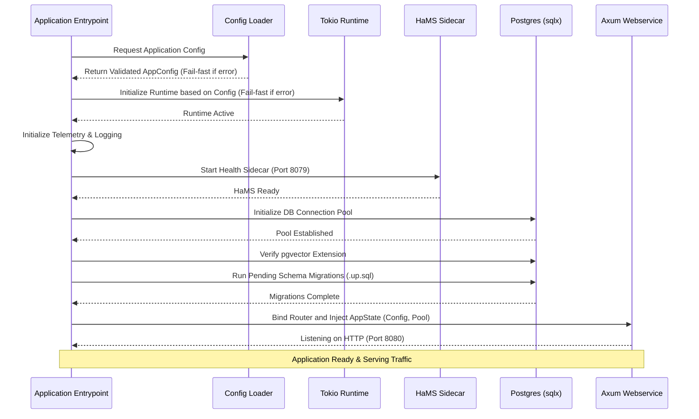

# Backend Foundations Product Requirements Document (PRD)

## Overview
This PRD outlines the architectural foundations and standard patterns for the Rust backend microservice based on the `agent-as-data` model. The purpose of this architecture is to provide a robust, observable, and fail-fast backend service utilizing Rust, Axum, PostgreSQL (with pgvector), and a dedicated health monitoring sidecar (HaMS).

## System Architecture

```mermaid
flowchart TD
    subgraph "External"
        Client[Web Client / API Consumers]
        LLM[LLM API Services]
    end

    subgraph "Backend Container"
        ConfigLoader[AppConfig Loader\n(YAML + Env)]

        subgraph "Application Core (Rust)"
            Axum[Axum REST API]
            LLMTools[LLM Tools / Integrations]
            State[App State\n(Connection Pools & Config)]
        end

        HaMS[HaMS\n(Health Monitoring Sidecar)]
    end

    subgraph "Data Storage"
        Postgres[(PostgreSQL)]
        PgVector[pgvector Extension]
        Postgres --- PgVector
    end

    Client -->|HTTP Requests| Axum
    Axum <--> State
    State <--> LLMTools
    LLMTools <-->|External Calls| LLM
    State <-->|SQLx Connection Pool| Postgres
    HaMS -->|Metrics / Health Probes| Client
    ConfigLoader -->|Injects Validated Config| State
```

## Core Components & Requirements

### 0. Developer Tooling (Make)
**Objective:** Provide ergonomic syntactic sugar for common development actions.
- A root-level `Makefile` exposes targets to simplify the build, test, and run cycles.
- Targets should include: `make dev` (start server with port cleanup), `make watch` (hot-reloading via cargo watch), `make migrate`, and `make test`.

### 1. Configuration Loading
**Objective:** Guarantee that the application operates only with valid, well-formed configuration, failing immediately upon startup if any properties are missing or invalid.
- **Centralized Loader:** All application configuration must be loaded into strongly typed structs at startup (e.g., via `config` crate).
- **Fail-Fast Validation:** The system must validate the configuration scheme before establishing database connections or binding network listeners.
- **Zero Direct Runtime Environment Variables:** Accessing environment variables directly in business logic (e.g., `std::env::var`) is strictly prohibited. All environment variables must be loaded and merged into the central `AppConfig` at startup.
- **No Hardcoded Defaults in Logic:** Hardcoded fallback values in handlers or execution paths are not allowed.

### 2. Async Runtime Execution (Tokio)
**Objective:** Control the execution environment of the application deterministically via configuration.
- **Configurable Runtime:** The Tokio runtime must be initialized using parameters loaded from the centralized `AppConfig` (e.g., under a `runtime` key).
- **Thread Management:** The number of worker threads must be configurable.
  - Setting threads to `0` configures a single-threaded runtime (`new_current_thread`).
  - Setting threads to `> 0` configures a multi-threaded runtime (`new_multi_thread`) with the specified number of workers.
- **Additional Parameters:** Configuration should also support defining:
  - `stack_size`: Thread stack size in bytes.
  - `name`: Name prefix assigned to worker threads (e.g., for debugging and tracing).
  - `metrics_interval`: Interval for Tokio metrics reporting.
- **Fail-Fast Initialization:** If the runtime fails to build (e.g., due to invalid thread parameters), the application must fail-fast and panic immediately upon startup.
- **Isolation:** All long-running async tasks, including migrations and the main web service, must run within this explicitly configured runtime.

### 3. Database & Storage Layer
**Objective:** Manage structured relational data and high-dimensional vector embeddings safely and predictably.
- **PostgreSQL Connection Pool:** Application state must maintain a connection pool (via `sqlx`) to PostgreSQL.
- **pgvector Integration:** The backend must support vector operations (e.g., semantic search) and must explicitly verify the existence of the `pgvector` extension during the application startup process.
- **Automatic Migrations:** Database schema definitions are represented as `.up.sql` migration scripts. The application must run these migrations automatically and sequentially upon startup before serving traffic.

### 4. Axum Web Service
**Objective:** Serve scalable and performant REST APIs.
- **Framework:** The primary webservice will utilize `Axum` built on top of the Tokio async runtime.
- **App State Injection:** The webservice must receive a shared `AppState` containing the database connection pool, metrics recorder, and read-only configuration context.
- **Routing & Handlers:** Routes should be declarative and well-separated into functional domain modules.

### 5. Health Monitoring Sidecar (HaMS)
**Objective:** Decouple application health reporting and metric telemetry from the primary business logic webservice.
- **Sidecar Process:** The backend runs a separate sidecar listener (HaMS) typically on a dedicated port (e.g., `8079`).
- **Telemetry & Probes:** HaMS provides endpoints for Kubernetes-style liveness/readiness probes and exposes Prometheus metrics scraped from the application state.
- **Lifecycle Integration:** The sidecar starts immediately after configuration validation but before DB connections are made, allowing it to signal application startup issues early.

### 6. LLM Tools Integration
**Objective:** Provide internal abstractions for connecting to, prompting, and orchestrating Large Language Models.
- **Interfaces:** The backend must include tools (`llm_tools`) that abstract API requests to LLMs (e.g., OpenAI, Anthropic, or local models).
- **Configurable Endpoints:** LLM configuration (endpoints, keys, model names, timeout settings) must be strictly managed through the centralized config loader.

## Application Startup Lifecycle



## Related Standards
For development conventions, PR branch guidelines, and server watch mechanics, please refer to the `AGENTS.md` guidelines at the repository root.
